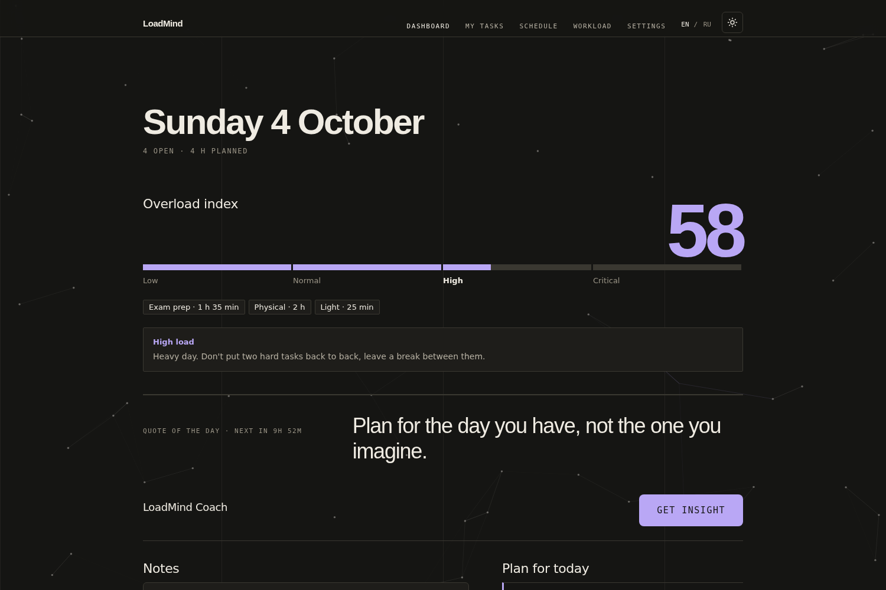
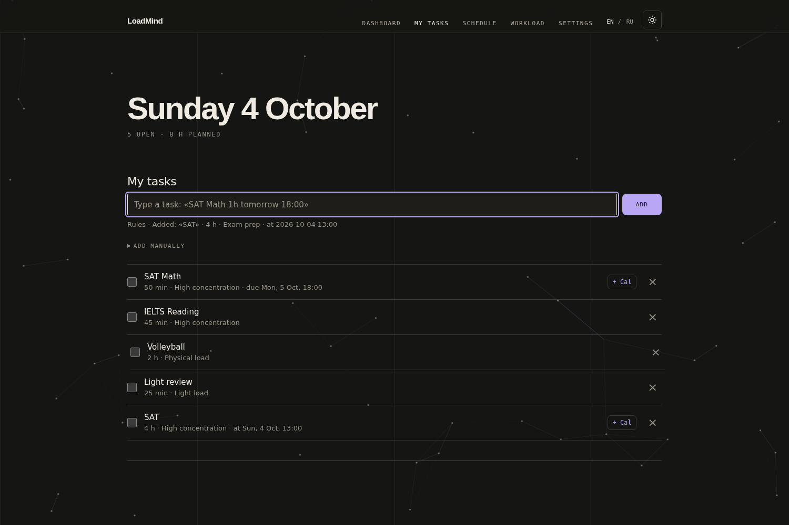
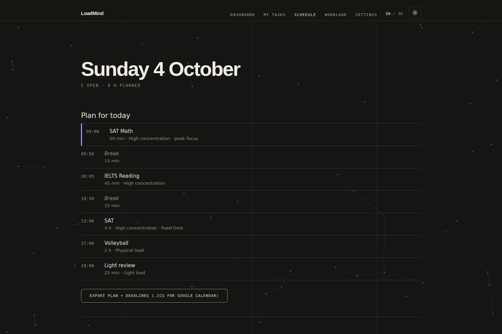
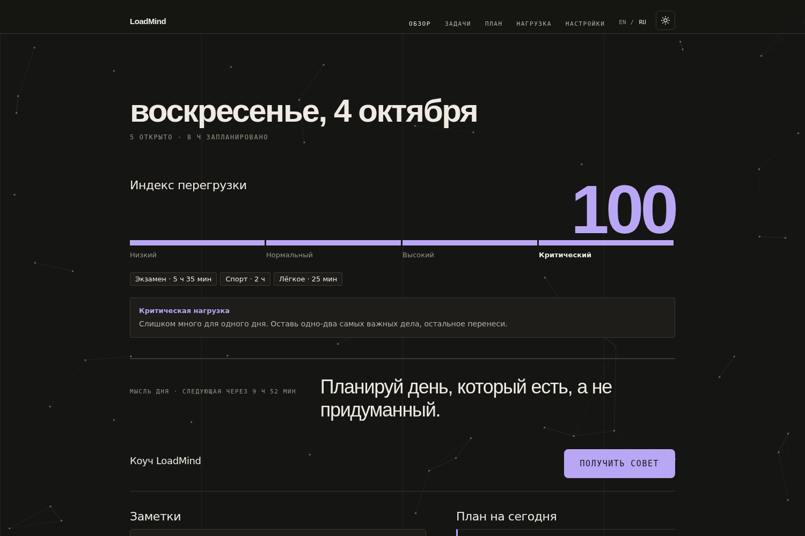

# LoadMind

LoadMind helps students plan their day. You type in your tasks, it builds a realistic schedule and tells you when a day is simply too much.

Live demo: https://loadmind.hassimx.workers.dev

## What it does

You add a task in one line, in English or Russian. "SAT 4 hours 13:00-17:00" becomes a task with a start time, and "by Friday 18:00" becomes a deadline. From your open tasks LoadMind makes a plan for the day. Hard tasks are placed at the hours when you focus best, and long sessions are followed by a break. The schedule itself is built by plain rules.

It also shows an Overload Index from 0 to 100. The number depends on how much work is still open, how many hours you can realistically handle in a day, and a short note you can write about how the day went. When you are happy with the plan, you can export it to Google Calendar, either as an .ics file or as a link for each task.

  
  
  

## How it works

It is a plain web page with no build step. The markup is in index.html. script.js has the task parser, the planner, the overload index and the calendar export. ui.js handles the language switch, the quote of the day and the background, and style.css has the look.

## Run it

Open index.html in your browser. There is nothing to install.

## Research behind it

The idea of putting hard work at your peak focus time comes from May, Hasher and Healey (2023): https://journals.sagepub.com/doi/10.1177/17456916231178553

Chronotype and grades turned out to be only loosely linked (Preckel et al., 2011), so LoadMind lets you choose your own peak time instead of guessing it: https://eric.ed.gov/?id=EJ938525

The 15-minute breaks are based on Albulescu et al. (2022): https://www.ncbi.nlm.nih.gov/pmc/articles/PMC9432722/

## Limits

Your tasks are stored only in your browser. They do not sync between devices, and clearing the site data will delete them.

## What I want to add next

Accounts with a database, two-way calendar sync, Telegram reminders and a Kazakh interface.

I built LoadMind on my own.
